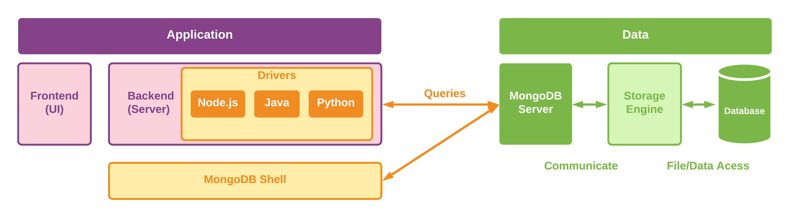
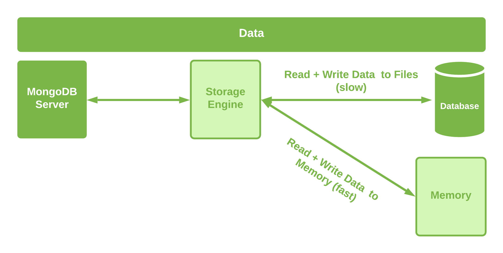

# MongoDB behind the scenes
* So we can generally differentiate between the application layer and the data layer.

1. **Application Layer**
* There will a frontend. It can be a single-page application / mobile app or your views.
* You have your backend(server), where you have your logic.
* In your backend, you have your drivers in different languages.
* The drivers interact with the MongoDB server.
* You can also use MongoDB Shell to write all the queries.
* MongoDB shell can be used for administrative purposes from your company network through the shell.

2. **Data layer**
* MongoDB server does not directly write data into files but it talks to a storage engine which can be replaced with your favorite storage engine but the default one is called the WiredTiger which helps to work with data storage efficiency and so on.
* The MongoDB server gets the query from your driver or your shell and forwards it to the storage engine after which the storage engine stores it in the files at the end.
* Now we need to differentiate between read/write from files that are slower and read/write from memory which is faster.
* The storage engine loads a chunk of data into memory and manages it such that the data you use often is in memory if possible
* The storage engine stores the data in the memory first since it is faster but eventually after a while it then stores the data in files as well.